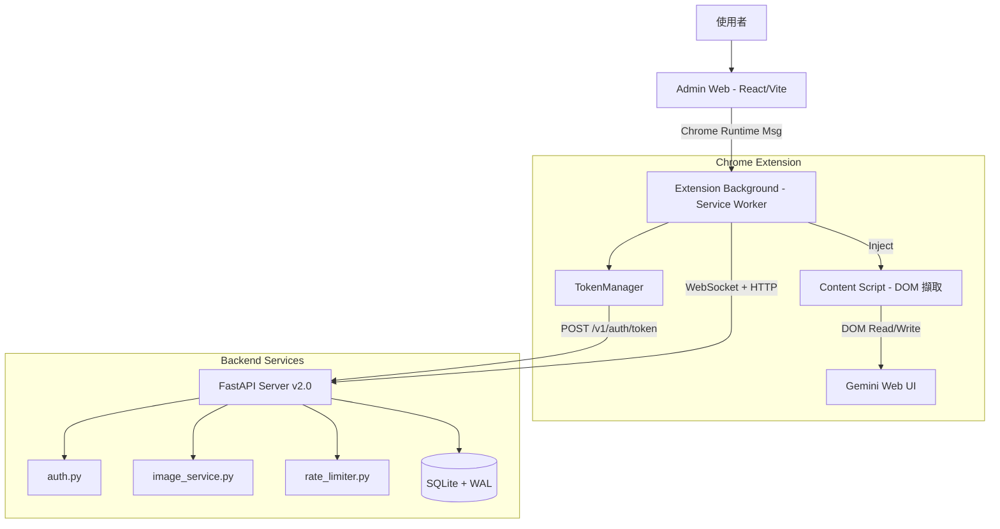

# GAPI 專案架構書 v2.0

## 1. 專案概述

構建一套「AI 側邊開發環境」，透過 Chrome 擴充功能與 Python 中介伺服器，實現對 Gemini/Claude 網頁版的雙向控制與對話管理，並提供獨立的 Admin Web 介面進行操作。

## 2. 系統架構圖



## 3. 目錄結構

```
GAPI/
├── server/                      # Python 後端
│   ├── mcp_server.py            # FastAPI 主應用（路由、WebSocket、SQLiteStore）
│   ├── auth.py                  # 認證模組（token/API key 生成與驗證）
│   ├── image_service.py         # 圖片服務（儲存、驗證、路徑管理）
│   ├── rate_limiter.py          # 速率限制器（per-IP 滑動視窗）
│   ├── requirements.txt         # 依賴（版本鎖定）
│   ├── .env.example             # 環境變數範本
│   ├── gapi.db                  # SQLite 資料庫
│   └── images/                  # 圖片儲存（按日期分類）
│       └── {year}/{month}/{day}/
│
├── admin-web/                   # React 管理面板
│   └── src/
│       ├── App.tsx              # 主應用元件
│       ├── api.ts               # Extension 通訊 API
│       ├── main.tsx             # 入口
│       ├── styles.css           # 樣式
│       └── components/          # UI 元件
│           ├── DashboardLayout.tsx
│           ├── SimpleSearch.tsx
│           └── LogView.tsx
│
├── background.js                # Extension Service Worker
├── content.js                   # DOM 擷取與操作腳本
├── content-gapi-formatter.js    # GAPI 資料格式化
├── db.js                        # IndexedDB 操作
├── manifest.json                # Extension Manifest
├── sidepanel.html / .js         # Extension 側邊面板
└── r2.js                        # Cloudflare R2 上傳
```

## 4. 模組架構

### 4.1 Server (FastAPI)

```
mcp_server.py
├── SQLiteStore          # 資料存取層
│   ├── sessions         # WebSocket session 管理
│   ├── conversations    # 對話 CRUD（cursor 分頁）
│   ├── messages         # 訊息 CRUD（attachments 安全解析）
│   ├── api_keys         # API Key CRUD（雜湊儲存）
│   └── images           # 圖片 metadata CRUD
│
├── WebSocketManager     # WebSocket 連接管理
│   ├── connect()        # 連接（自動斷開同 extension 舊連接）
│   ├── disconnect()     # 斷開（清理 session + mapping）
│   └── broadcast()      # 廣播
│
├── HTTP Endpoints
│   ├── /status                          # 健康檢查
│   ├── /v1/auth/token                   # 產生 token（rate limited）
│   ├── /v1/auth/validate                # 驗證 token
│   ├── /v1/auth/api-keys               # CRUD API keys（需認證）
│   ├── /v1/conversations               # 對話列表（cursor 分頁）
│   ├── /v1/conversations/{id}          # 對話詳情（含 messages）
│   ├── /v1/messages                     # 發送訊息
│   ├── /v1/images/*                     # 圖片上傳/查詢/刪除
│   └── /v1/bridge                       # CDP 橋接（legacy）
│
└── WebSocket Endpoint
    └── /ws/{client_id}                  # 認證 + 訊息處理
```

### 4.2 auth.py — 認證模組

| 函式 | 說明 |
|------|------|
| `generate_token(ext_id, ts)` | 生成 HMAC-SHA256 簽名 token（32 字元簽名） |
| `validate_token(token)` | 驗證 token 格式、過期時間、簽名（常數時間比較） |
| `generate_api_key(name)` | 生成 API Key pair（key_id, api_key） |
| `hash_api_key(key)` | SHA-256 雜湊（用於安全儲存） |
| `validate_api_key(key, store)` | 驗證 API Key（查 hash 對照資料庫） |
| `create_verify_auth(store)` | 建立 FastAPI Depends 認證依賴 |

### 4.3 image_service.py — 圖片服務

| 函式 | 說明 |
|------|------|
| `validate_magic_bytes(data)` | 檢查 JPEG/PNG/GIF/WebP magic bytes |
| `sanitize_filename(name)` | 清理檔名（移除不安全字元，限制長度） |
| `get_image_storage_path(name)` | 生成日期分類路徑（含路徑遍歷防護） |
| `save_image_to_file(data, name)` | 儲存圖片（大小/類型/magic bytes 驗證） |
| `decode_base64_image(url)` | 解碼 base64 data URL |
| `resolve_image_path(id, info)` | 解析圖片路徑（含遍歷防護） |

### 4.4 rate_limiter.py — 速率限制

| 限制 | 端點 | 上限 |
|------|------|------|
| `rate_limit_auth` | 認證端點 | 10 req/min |
| `rate_limit_upload` | 圖片上傳 | 10 req/min |
| `rate_limit_default` | 一般端點 | 60 req/min |

### 4.5 Client — background.js

```
background.js
├── TokenManager               # Token 管理器
│   ├── getToken()             # 取得 token（memory → storage → server）
│   ├── refreshToken()         # 從 server 更新 token
│   └── scheduleRefresh()      # 過期前 5 分鐘自動更新
│
├── GAPIWebSocketClient        # WebSocket 客戶端
│   ├── connect()              # 連接 + 認證
│   └── generateToken()        # 委託 TokenManager
│
├── GAPIHttpClient             # HTTP 客戶端
│   ├── init()                 # 初始化（TokenManager 取得 token）
│   ├── uploadImage()          # base64 圖片上傳
│   ├── uploadImageFile()      # File 圖片上傳
│   └── listImages()           # 列出圖片
│
└── adminPorts                 # Admin Web 連接（上限 20 個）
```

### 4.6 Client — content.js

```
content.js
├── observerManager            # MutationObserver 集中管理
├── eventManager               # Event Listener 集中管理
├── startMonitoring()          # 啟動 DOM 監聽
├── stopMonitoring()           # 全面清理
│   ├── observerManager.disconnectAll()
│   ├── History API 還原
│   ├── popstate removeEventListener
│   ├── fetch/XHR proxy 還原
│   └── eventManager.cleanup()
└── beforeunload/pagehide      # 頁面卸載時自動清理
```

## 5. 資料庫 Schema

```sql
-- Sessions（WebSocket 連線狀態）
CREATE TABLE sessions (
    session_id TEXT PRIMARY KEY,
    extension_id TEXT NOT NULL,
    expires_at INTEGER NOT NULL,
    created_at INTEGER
);

-- Conversations（對話）
CREATE TABLE conversations (
    id TEXT PRIMARY KEY,
    title TEXT NOT NULL,
    created_at INTEGER NOT NULL,
    updated_at INTEGER NOT NULL
);

-- Messages（訊息）
CREATE TABLE messages (
    id TEXT PRIMARY KEY,
    conversation_id TEXT NOT NULL REFERENCES conversations(id),
    role TEXT NOT NULL,
    content TEXT NOT NULL,
    attachments TEXT,     -- JSON array or null
    timestamp INTEGER NOT NULL
);

-- API Keys（雜湊儲存）
CREATE TABLE api_keys (
    key_id TEXT PRIMARY KEY,
    api_key_hash TEXT NOT NULL UNIQUE,
    name TEXT NOT NULL,
    created_at INTEGER,
    expires_at INTEGER,
    is_active INTEGER DEFAULT 1
);

-- Images（圖片 metadata）
CREATE TABLE images (
    image_id TEXT PRIMARY KEY,
    url TEXT NOT NULL,
    filename TEXT,
    mime_type TEXT,
    size INTEGER,
    path TEXT NOT NULL,
    conversation_id TEXT REFERENCES conversations(id),
    created_at INTEGER
);

-- Indexes
CREATE INDEX idx_messages_conversation_id ON messages(conversation_id);
CREATE INDEX idx_messages_timestamp ON messages(timestamp);
CREATE INDEX idx_images_conversation_id ON images(conversation_id);
CREATE INDEX idx_sessions_extension_id ON sessions(extension_id);

-- Pragmas
PRAGMA journal_mode=WAL;
PRAGMA busy_timeout=5000;
PRAGMA foreign_keys=ON;
```

## 6. 認證流程

```
Extension                              Server
   |                                      |
   |--- POST /v1/auth/token ------------>|
   |    ?extension_id=xxx                 |
   |<--- { token, expires_at } ----------|
   |                                      |
   |--- WS /ws/{client_id} ------------->|
   |--- { type: "auth", token } -------->|
   |<--- { type: "auth_ok", session } ---|
   |                                      |
   |--- ping/pong (heartbeat) ---------->|
   |                                      |
   |  [Token 過期前 5 分鐘自動更新]        |
   |--- POST /v1/auth/token ------------>|
   |<--- { new_token } -----------------|
```

## 7. 環境變數

| 變數 | 預設值 | 說明 |
|------|--------|------|
| `GAPI_AUTH_SECRET` | 隨機生成（dev） | 認證密鑰（生產環境必設） |
| `GAPI_DEV_MODE` | `false` | 開發模式（允許無認證） |
| `GAPI_ALLOWED_ORIGINS` | `localhost,chrome-extension://*` | CORS 允許來源 |
| `GAPI_MAX_UPLOAD_SIZE` | `10485760`（10MB） | 最大上傳大小 |
| `GAPI_DB_PATH` | `./gapi.db` | SQLite 路徑 |
| `GAPI_IMAGE_DIR` | `./images` | 圖片儲存目錄 |
| `GAPI_RATE_LIMIT` | `60` | 一般端點速率限制/分 |

## 8. 啟動方式

```bash
# 安裝依賴
cd server
pip install -r requirements.txt

# 設定環境變數（生產環境）
export GAPI_AUTH_SECRET="your-secret-key"
export GAPI_DEV_MODE="false"

# 啟動伺服器
python3 mcp_server.py
# 或
uvicorn mcp_server:app --host 0.0.0.0 --port 18799

# 開發模式
GAPI_DEV_MODE=true python3 mcp_server.py
```

## 9. 安全措施

| 層面 | 措施 |
|------|------|
| 認證 | HMAC-SHA256 token、API Key 雜湊儲存、DEV_MODE 控制 |
| 傳輸 | CORS 白名單、Request ID 追蹤 |
| 上傳 | Magic bytes 驗證、MIME 白名單、大小限制、路徑遍歷防護 |
| 速率 | Per-IP 滑動視窗限制（認證/上傳/一般） |
| 錯誤 | 標準化回應、不暴露內部細節 |
| 前端 | 安全文字渲染、Observer/Event 全面清理、token 自動更新 |
